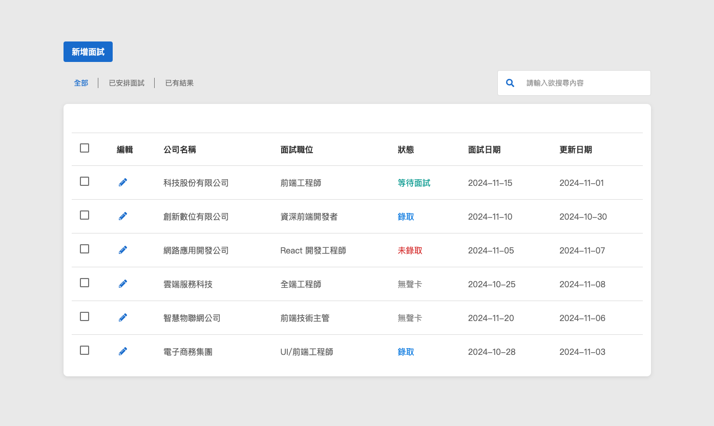

# 面試紀錄系統
[Demo](https://dio-chu.github.io/React-interview-todo-list/ "link")

這是一個面試紀錄系統，以「面試中的前端工程師角度」設計，用於記錄和管理面試的詳細信息。系統主要通過列表（List）展示每個面試的以下信息：

- **公司名稱**
- **面試職位**
- **狀態**
- **面試日期**
- **更新日期**

系統還提供兩種過濾和搜尋方法：**Select** 和 **Search**，以便更方便地查找和管理面試紀錄。

## 功能介紹

### 1. 列表展示（List）

- 列表顯示所有面試的詳細信息，每一項面試紀錄作為一個列表項目（ListItem）顯示在系統中。

### 2. 過濾和搜尋

- **Select**：通過下拉選單過濾特定條件的面試紀錄。
- **Search**：通過關鍵字搜尋面試紀錄。

### 3. 批量選擇與刪除

- 列表項目旁邊有復選框（CheckBox），用戶可以勾選單個或多個列表項目進行批量操作。
- 列表頭（ListHeader）的復選框可以勾選或取消選擇所有列表項目的復選框。

## 自訂組件

為了提升系統的可維護性和重用性，我自行開發了多個自訂組件，包括但不限於：

- **DButton**：自訂按鈕組件，支持多種樣式和尺寸。
- **DSelect**：自訂橫向的選擇群組組件。
- **DCheckbox**：自訂復選框組件，支持批量選擇功能。
- **DTextField**：自訂文字輸入框組件，支持圖標和錯誤訊息顯示。
- **DModal**：自訂模態視窗組件，支持動畫效果和可訪問性。
- **DCommonModal**：繼承 DModal，增加 header,content,footer。
- **InterviewFormModal**：繼承 DCommonModal，TodoPage 專用組件，根據頁面帶入的參數切換新增與編輯。
  
  
